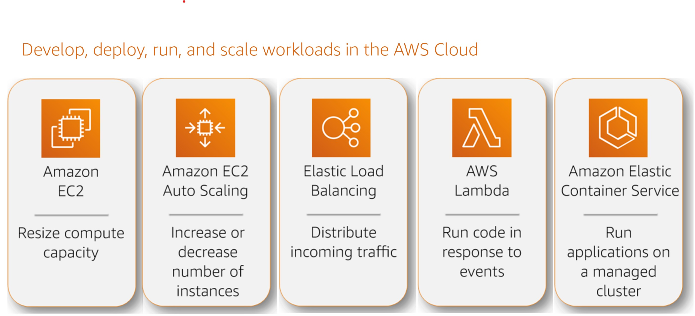
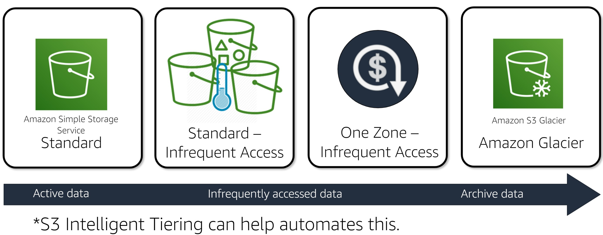
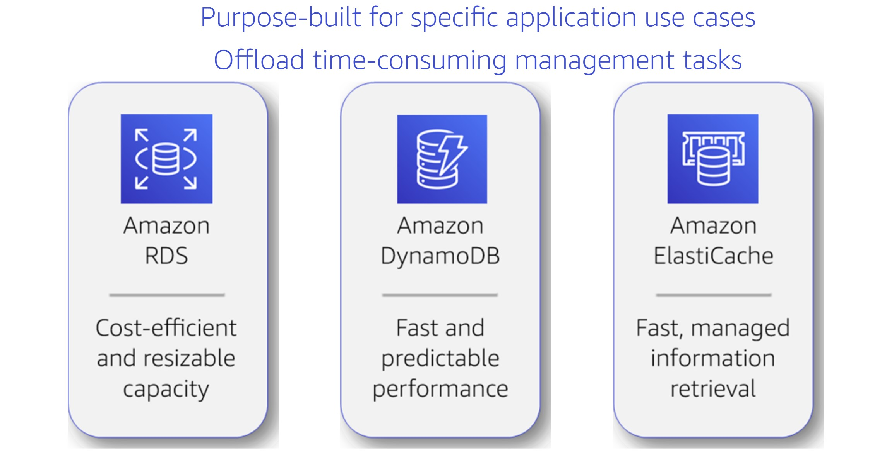
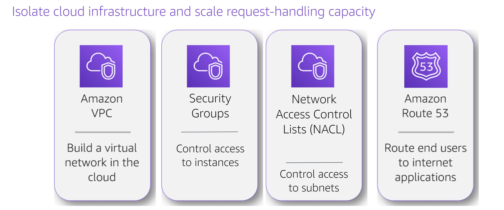
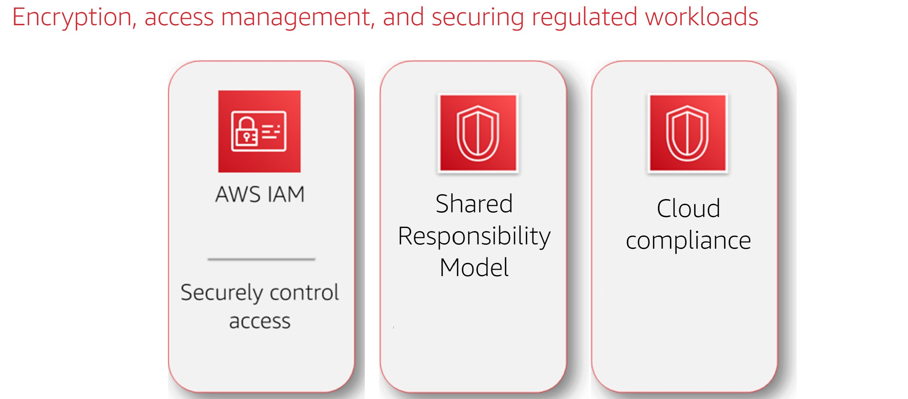
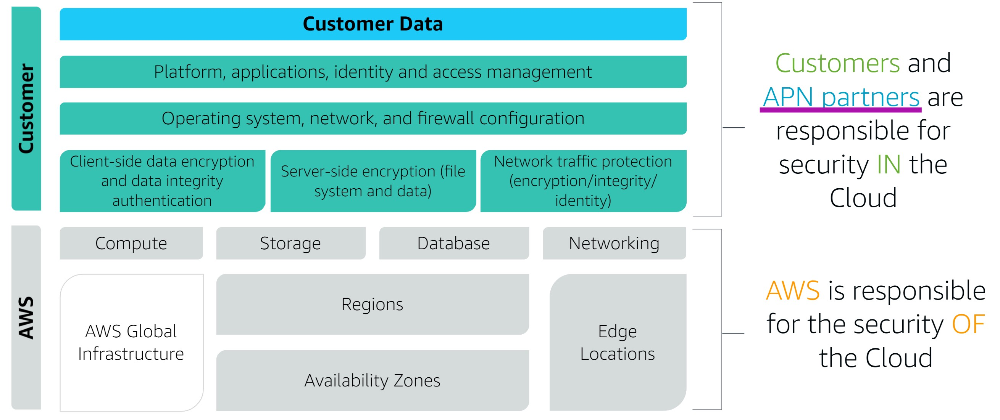

# AWS Core Technologies :

## Cloud :

In contast with On-Premises IT, the user will access ressources ( apps/ database/ server / storage ... ) throught the internet. 

## Cloud computing :

It's an on demand delivery of compute power, database, storage,.. via the internet with pay as you go pricing.
    
## Advantage of cloud computing :
    
1. Variable expense : 
**only pay** for what the customer consumes **when they need to**.
2. Benefit from massive economy of scale : 
AWS achieves heigher economy of scale -> **lower pay as you go prices**.
3. guessing capacity : 
**Eliminates guessing on infrastructure capacity** needs, no idle ressouce waiting, ressources in cloud computing can **scale according to the demand**.
4. Speed and agility :
New IT ressources are available within minutes.
5. **Stop spending money** on running and maintaining infrastructure.
6. Deploy globally (multiple regions) in minutes.

> AWS offers a huge range of features and services to help customers achieve their goals.
        
#        
## AWS Global [Infrastructure](https://www.infrastructure.aws/)

-    ### AWS Regions:

        AWS cloud computing ressources are hosted in multiple locations called **AWS regions**. 
        Each region is **completly isolated** -> great fault tolerance and stability -> increased [resiliency](https://en.wikipedia.org/wiki/Resilience_(network)). 
        
        > Ressources **are only viewable withtin the region**, no ressources are replicated automatically across regions.

-    ### Availibility zone (AZ):

        Seperated geographic area with multiple isolated locations. All AZ are interconnected with high bandwidth low latency fully [redundent fiber](https://blog.ospinsight.com/the-importance-of-fiber-network-redundancy).
        
        A minimum of 2 AZ is available in each region.

        > Deploying on multiple AZ in the same region **improves availability**.

-    ### Points of Presence (POP):

        Edge locations and regional Edge cache servers are used by Amazon CloudFront to deliver data, video, apps and APS with low latency transfer speed.

## AWS core categories :

AWS has infrustructure services in different catgeories : Compute, Storage, Database, Security, Management, Networking. Thus offering a **high degree of architecture flexebility**. Cutomers can power up Web & Mobile apps, Data processing and Warehousing, Storage and archiving.

#
## [Compute](https://aws.amazon.com/products/compute/) services EC2 

They allow customers to Develop, Deploy, Run & scale workloads.
They are the compute building blocks and comes with a large variaty of hardware configurations. Their software are customizeable at launch trough **AMI**. Can be used with auto scaling and load balancers.

> 
### AWS compute services

1. **Amazon EC2** : Amazon Elastic Compute Cloud.

    A web service that provides resizeable secure compute capacity in the cloud.

    > compute capacity refers to that functionality that is traditionally provided by on premises and virtual servers.

2. **Amazon EC2 [Auto Scaling](https://aws.amazon.com/ec2/autoscaling/)**.

    Customer can maintain the health and availability of their applications by **setting triggers** to **automatically increase/decrease** the number of instances

    **automatically add/remove EC2 instances** to adapt to demand.
    
    - It can **monitor the health** of running instances. When an instance fails the health check it will get terminated and replaced by a new one. 

    - It also **automatically balance instances across zones**.

    - Ensure **Dynamic** and **Predictive Scaling**

3. **Amazon ELB** : [Elastic Load Balancing](https://aws.amazon.com/elasticloadbalancing/).

    It increases **availability** and **fault tolerance** of apps.

    **Distributes** application traffic across **multiple targets** : EC2 instances, containers, IP adresses and lamda functions. in one or more availability zones.

    The load balancer sends requests only to **healthy instances** which are configured by the customer.

    They can offload encryption and decryption so that instances only needs to focus on their main work.

    There are three types of load balancers :

    1. Application load balancer.(*For web apps with http and https*)
    2. Network load balancer.(*more resilient on traffic spikes*)
    3. Classic load balancer.(*previous generation load balancer for EC2 classic instances*)

4. **AWS Lambda**.

    Runs code without server management. It is referred as **serverless computing**. Codes are run withtin **milliseconds of an event**

5. **Amazon ECS** : Elastic Container service.

    Highly scalable, high performance container management service that **supports docker containers**. It allows easy running of apps on a **managed cluster of Amazon EC2 instances**.

### AWS EC2 Benefits :

1. **Elasticity** : 

    Increase and decrease capacity withtin minutes.
    combined **with EC2 autoscaling**, customers maintain availability and scale down and up automatically -> maximized perfromance and minimized costs.

2. **Complete control** :

    100% control with root access.

3. **Flexible hosting** :

    Choosing instances types, OS and software packages.

4. **Integrated with most AWS services** :

    Provides secure solution for compute, query processing and storage.

5. **Reliability** :

    Instances can be rapidly and predictably commissioned.

6. **Secure**
7. **Inexpensive** :

    Pay a very low rate for the consumed compute capacity.

8. **Easy to get started** :

    Free to get started.
          
### AWS EC2 [Instance types](https://aws.amazon.com/ec2/instance-types/)  :
        
Refers to the hardware capabilities of an instance.

1. **General Purpose** :

    provides balance between compute, memory any network ressouces.

2. **Optimized** :

    Using High perfromance processors ideal for compute bound apps.

3. **Memory Optimized** :
    
    Fast perfromance for large datasets in memory.

4. **Accelerated** :
    
    Using hardware accelerators or co processors for accelerated floating point calc, data pattern processing, gpu processing, ...

5. **Storage Optimization** :   
        
    For high sequential read/write access. 10.000 of IO access/second.

> Each category has different families, example : A,T,M inside the general purpose category.

### Amazon Machine Images (AMI) :

Initial software configuration of an instance.
AMIs must be specified when launching the instance.
AMI are provided by AWS, AWS marketplace, User community, or custom AMIs chich can be created and managed by the customer.

### Scalable architecture :

In the Cloud, **computing power is a programmatic ressource**, allowing **flexible scaling** approach:

1. Launch new instances in advance of Peak Periods.

2. Use Monitoring to programatically scale out.
    
3. Automatically scale down when the need is low.

> The customer only pays for the used ressources.  
# 
## [Storage](https://aws.amazon.com/products/storage/) Services 

A reliable, scalable and secure place for data.

> 

### AWS storage services
    
1. **Amazon Elastic Block Store (EBS)** :

    **Persistent storage** like a hard drive. Customers can create partitions on it, format it and boot from it. It Persists **independently** from the **instances**. 
    
    They are automatically **replicated across zones** to prevent data loss.

    Can be attached to **any instance in the zone**.

    Can only be **attached to one EC2 instance** except in the case of using **multi attach OPS ssd** (max 16 instances).
    
    One instance can attach to **multiple EBS volumes**.

    Allow point in time snapshots which are stored in S3. The **snapshot** can be **copied across regions**.

    > Sizes are between 1 Giga Byte to 16 Terra Byte **allocated by 1 Giga Byte increment**.

2. **Amazone Simple Storage service [(S3)](https://aws.amazon.com/s3/)**:

    Storage for internet wich privides simple web service interface which can be used to store and retrieve data from the internet.

    It's an object storage service. It stores data in objects called **buckets** 

    **Unlimited** number of objects , each with a **max size of 5 Terrabyte**.

    It supports eleven 9s of durability and four 9s of availibility.

    > 

    > **Use cases** : 
    >
    > - backup and storage
    > - application hosting
    > - media hosting
    > - software delivery ( downloadable software )

3. **Amazon S3 Glacier**:

    For data archiving. It allows the easy storage of big data with low cost for decades.

4. **AWS storage Gateway**: 

    Transfer data between on promises sites and aws storage infrastructure (in and out). 

5. **Amazone Elastic File System (EFS)** :

    File storage for EC2 instances. It provides a simple interface for creating and configuring file systems.
    The storage is elastic.

### [Storage classes](https://aws.amazon.com/s3/storage-classes/) :

> 

1. **S3 standard** : for frequently accessed data, low latency high throughput.
    
2. **S3 standard infrequent access (IA)** : for data that is accessed less frequently, but rapidly. cost less then S3 standard and is ideal for long term storage, backups and disaster recovery files.
    
3. **S3 One Zone IA** : costs 20% then standard IA. costs 20% less, good for secondary backup copy or easy recreatble data.

4. **S3 Glacier** : For data archiving. It allows the easy storage of big data with low cost for decades.provides three retrieval options.

> **S3 intelligent tiering** is offered in order to **automate cost saving** by moving data between **two acces tiers** configured by the customer.

#        
## [Database](https://aws.amazon.com/products/databases/) Services  

### **Advantages Over EC2**

- **Easier to setup an maintain** then running database software on EC2. 

- Backup/recovery/managing patches/updates .. is done automatically within amazone RDS.

- High available database, synchronous multi zone deployment.

- Synchronized replication for high availability oracle.

- No need to manage backups and point in time recoveries.

### **Disadvantage in contrast to EC2**

- **In Ec2** the customer has **more control and flexibility**.

- Operating System access. Use of commercial software not supported by database services.

>   

### **Database Storage Types:**

1. Amatzon RDS :
    
    Supports Amazone Aurora/Postgres/MariaDB/MySQL/Oracle/MySQL server. Scalable, cost efficient and resizeable capacity.
    
    Has automatic backup, snapshots, automatic host replacement.

2. Amazon DynamoDB :

    noSQL database. fast and predicatble performance in range of millisecond digits.

3. Amazon ElastiCache :

    Deploy in memory cache in the cloud. Improves the performance of web apps from a fast managed in memory cache instead of slower disk based databases.

#     
## [Networking](https://aws.amazon.com/products/networking/) services 

It enables customers to build a virutal private network in the cloud ([VPC](https://en.wikipedia.org/wiki/Virtual_private_cloud)).

It provides security features for group access and network access control lists.

Amazon53 is a **DNS service** that routes users to applications by translating human readble names into IP addresses.
            
> 

### **Amazon Virtual private Network (VPC):**

- Customers have complete control over their virtual network : 
    
    1. Select their IP ranges.
    2. Create subnets.
    3. Configure route tables and gateways.
        
- Ressouces can be launched into a specified [subnets](https://en.wikipedia.org/wiki/Subnetwork):
    
    1. **public subnet** : for for ressources connected to internet 
    2. **private subnet** : ressources that are not connected to internet.

### **[Amazon network security](https://aws.amazon.com/answers/networking/vpc-security-capabilities/)**
- **Amazon Network security groups:**

    - controls traffic at the instance level like a firewall.
    - 5 security groups can be set per instance.
    - If not set a default security froup will be applied. 
      
- **Amazon Network access control Lists (NACL):**

    - controls traffic at a subnet level.

- **VPC flow log** 
    - captures netwokr information and store it in **Amazon CloudWatch** Log. It can be used to check why a traffic is not reaching an instance which might be causes by over restrictive security groups.

- **Host based Firewalls**
    - can be enabled at the operating system. example iptables, windows fierwalls or third party ones.

# 
## **Amazon [security,identity and compliance services](https://aws.amazon.com/products/security/)**

**Benefits** of AWS Security:

- **Keeps Your Data Safe**: The AWS infrastructure puts strong safeguards in place to help protect customers privacy. All data is stored in highly secure AWS data centers.

- **Meet Compliance Requirements**: AWS manages dozens of compliance programs in its infrastructure. This means that segments of your compliance have already been completed.

- **Save Money**: Cut costs by using AWS data centers. Maintain the highest standard of security without having to manage your own facility

- **Scale Quickly**: Security scales with your AWS Cloud usage. No matter the size of your business, the AWS infrastructure is designed to keep customers data safe.

> 

### **AWS Identity and access management ([IAM](https://aws.amazon.com/iam/))**

Manages access to AWS services and ressources. Throught IAM, user and groups can be created and permission can be managed.
It allows :

- **Fine grained access to AWS ressources**. ( limiting users to certain ressources, specific access at a specific time of day , ...)
- **Multi factor Authentication** for priviledged users.
- Possibility to **analyze access**.
- **Integration with corporate directories** to allow **[federated access](https://en.wikipedia.org/wiki/Federated_identity)** like Microsoft active directory.
 
### **AWS [shared responsability model](https://aws.amazon.com/compliance/shared-responsibility-model/)**

> 

- AWS is responsible for the **security of the cloud** : hardware, software networking and facilities. It is also reponsible for the security configurations of it's products.

- Customers are reponsible for the **security in the cloud** : security of customer content and applications that use AWS services.
### **AWS cloud [compliance](https://aws.amazon.com/compliance/)**

- AWS environment are continuasly audited.
- AWS shars information about industry certifications, security and control practices.

#     
## [Management Interfaces](https://docs.aws.amazon.com/)

**Three way of management** based on **restfull api**

- AWS **management console** :GUI Interface to manage cloud.
- AWS **Command Line Interface** (CLI) interface allows access via commands.
- AWS **Software development Kits** (SDK) allows acces inside code. 

#
## Conclusion

- AWS offers more then 165 services: from compute, storage, machine learning, analytics, IoT  